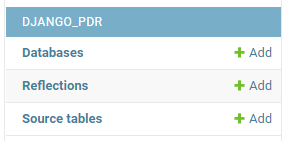
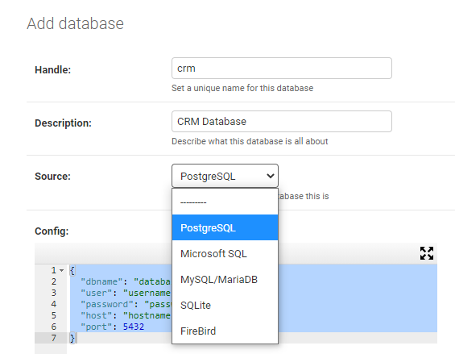
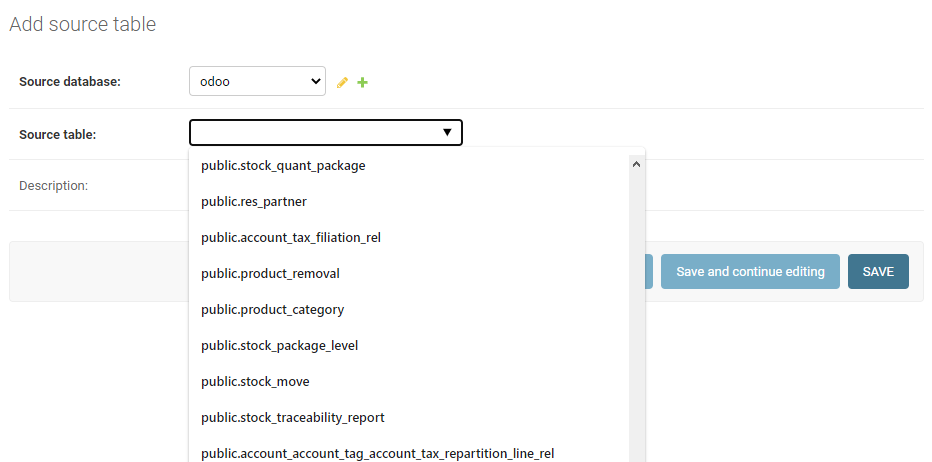
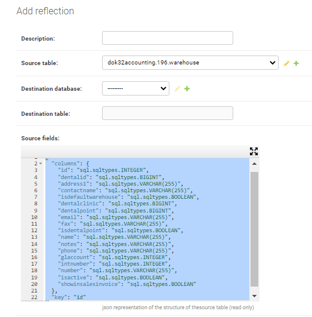

<!-- PROJECT LOGO -->
<br />
<p align="center">

  <h3 align="center">PDR (Pantograph Database Replicator)</h3>

  <p align="center">
    Flexible Database replication system compatible with most SQL databases
    <br />
    <small>This README is intended to be viewd <a href='https://github.com/meena-erian/pdr'>on github </a>some links and updates might not reflect correctly in the PyPI website.</small>
  </p>
</p>


<!-- TABLE OF CONTENTS -->
<details open="open">
  <summary>Table of Contents</summary>
  <ol>
    <li>
      <a href="#about-the-project">About The Project</a>
      <ul>
        <li><a href="#features">Features</a></li>
        <li><a href="#built-with">Built With</a></li>
      </ul>
    </li>
    <li>
      <a href="#quick-start">Quick Start</a>
    </li>
    <!--<li><a href="#usage">Usage</a></li>-->
    <li><a href="#roadmap">Roadmap</a></li>
    <li><a href="#contributing">Contributing</a></li>
    <li><a href="#license">License</a></li>
    <li><a href="#contact">Contact</a></li>
    <li><a href="#acknowledgements">Acknowledgements</a></li>
  </ol>
</details>


<!-- ABOUT THE PROJECT -->
## About The Project

PDR is a standalone Django app for establishing a reliable, high-performance, cross-platform, live mirror of any table[s] in an SQL database server to any other SQL database server. 
<br />
Pantograph database replication is event driven, not time driven, ie. it doesn’t update the whole mirror database periodically; Instead, it updates each individual group of affected records in the affected table in the mirror at the moment it's modified in the original database. Which results in a more speedy instant update, yet consumes less bandwidth and server resources.
Pantograph database replication is also perfectly reliable because the server listening for changes doesn’t has to be online at the moment changes occur. Instead, the host server creates notification channels where changes are stacked awaiting the listening server’s action to read notification, and update its replications in remote servers.
<br />
A list of commonly used resources that I find helpful are listed in the acknowledgements.

### Features

1. Can replicate data to multiple tables in separate databases.
2. Can replicate data into a new structure, yet, keep it live.
3. Can be used with most RDBMS. Currently supports Microsoft SQL, PostgreSQL, MySQL, MariaSQL, SQLite, FirebirdSQL.
4. Very reliable as PDR events are created by native SQL trigger functions inside source databases.
5. High in performance as it’s event-driven.
6. One-way data replication can be used to join data from multiple different tables in multiple different databases into one live table.
7. Provides a simple easy to use GUI to configure replications.
8. Distributed as a standalone Django app wrapped in a PyPi package so you can easily integrate it with any existing Django Project.


### Built With

The project is based on Django, the popular python framework, SQLAlchemy, A wonderful open-source SQL abstraction layer for the Python programing language, and native SQL trigger functions.


## Quick start

1. Run  `pip install django-pdr` to install django_pdr's python package from the python package index

2. Add "django_pdr" and "django_ace" to your INSTALLED_APPS setting like this:

```python
INSTALLED_APPS = [
    ...
    'django_ace',
    'django_pdr',
]
```

3. Include the admin URLs anywhere in your project urls.py like this:

```python
from django.contrib import admin

urlpatterns = [
    ...
    path('admin/', admin.site.urls),
]
```

4. Run `python manage.py makemigrations` and then `python manage.py migrate` to create django_pdr's data models.

5. Start the development server and head over to the Django admin website. You will find that Django_pdr's data models has been added.

   

6. Start by adding all source and destination databases you wan to replicate data from/to. To add a database, first select the `Source` RDBMS type. Once you select any type, it will show a placeholder JSON connection `Config` edit this JSON code with the configuration of your database. And then fill in the rest of the form and save it.

   

7. Once you add your databases, you can set any table from any database as a SourceTable. To define a table as a SourceTable, first select the database where the table exists, and Django_pdr will automatically list all tables in that database. Select one and save.

   

8. Now that you have defined SourceTables, it's time to create Reflections. A Reflection defines how any changes in records in a source table should reflect in another table. Any SourceTable can have as many Reflections as you want, and Reflections are very flexible since they can reflect data into a whole new structure, in an entirely different database system, yet keep it up to date.
 The first step to add a reflection is by defining the SourceTable and then the destination database, and finally the destination table. Once you do so, it automatically generates default Reflection configuration represented in the `Destination Fields` JSON object and the `Reflection statement`. Initially, the `Destination Fields` JSON is the same as the `Source Fields` JSON. Which defines the columns of the table and the primary key. However, you can customize the JSON of the `Destination Fields` and the SQL `Reflection statement` to change which fields you want to be replicated and how exactly do you expect them to be replicated.
 
   

9. In another terminal window, run the command `python manage.py pdr-reflect -i 1` to start the PDR background activity. The pdr-reflect management command checks if there are any pending changes in any source table if it finds any, it reflects them into their destination Reflection or Reflections. the `-i` option is the interval in seconds, during which the server checks if there are any pending changes. Setting this interval to a small value can take more from the network bandwidth in case of setting too many reflections. Setting it to a great value can result in a delay in replication, however, all changes will be reflected sooner or later.


<!-- ROADMAP -->
## Roadmap

See the [open issues](https://github.com/meena-erian/pdr/issues) for a list of proposed features (and known issues).


<!-- CONTRIBUTING -->
## Contributing

Contributions are what make the open source community such an amazing place to be learn, inspire, and create. Any contributions you make are **greatly appreciated**.

1. Fork the Project
2. Create your Feature Branch (`git checkout -b feature/AmazingFeature`)
3. Commit your Changes (`git commit -m 'Add some AmazingFeature'`)
4. Push to the Branch (`git push origin feature/AmazingFeature`)
5. Open a Pull Request


<!-- LICENSE -->
## License

Distributed under the Apache 2 License. See `LICENSE` for more information.


<!-- CONTACT -->
## Contact

Meena (Menas) Erian - menas@portacode.com

Project Link: [https://github.com/meena-erian/pdr](https://github.com/meena-erian/pdr)


<!-- ACKNOWLEDGEMENTS -->
## Acknowledgements
* [Python](https://www.python.org/)
* [Django](https://www.djangoproject.com/)
* [SQLAlchemy](https://www.sqlalchemy.org/)
* [Django ACE](https://github.com/django-ace/django-ace)
* [psycopg2](https://www.psycopg.org/docs/install.html)
* [pytz](https://pypi.org/project/pytz/)
* [Django pgcrypto](https://pypi.org/project/django-pgcrypto/)

